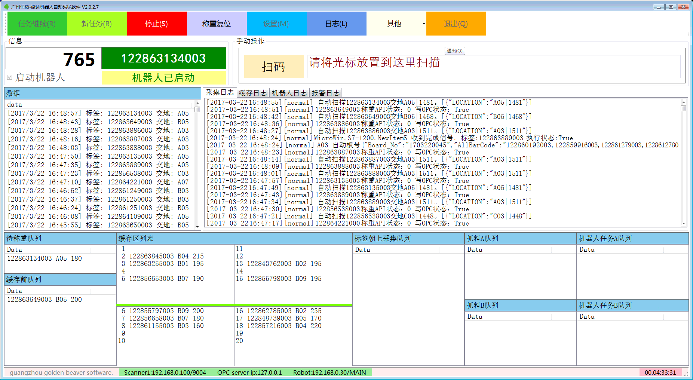
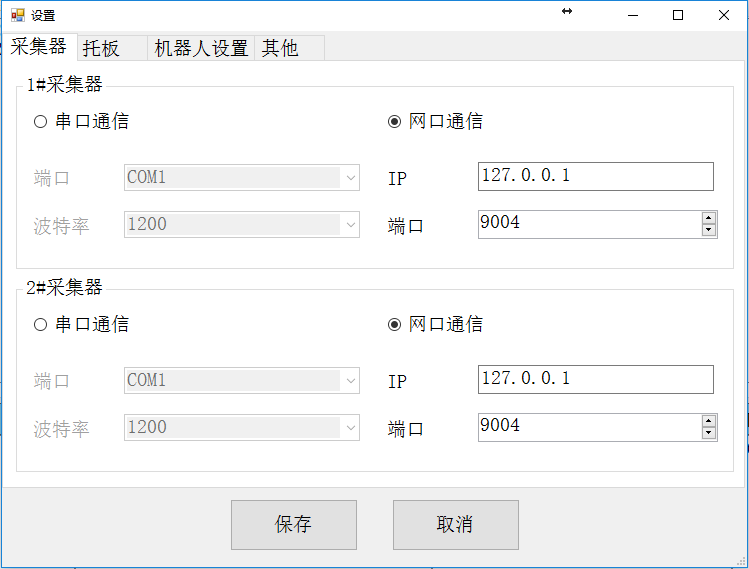
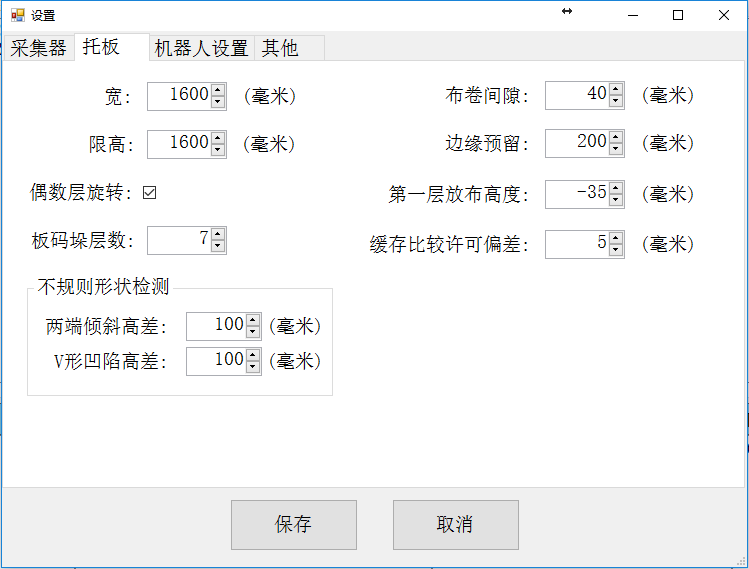
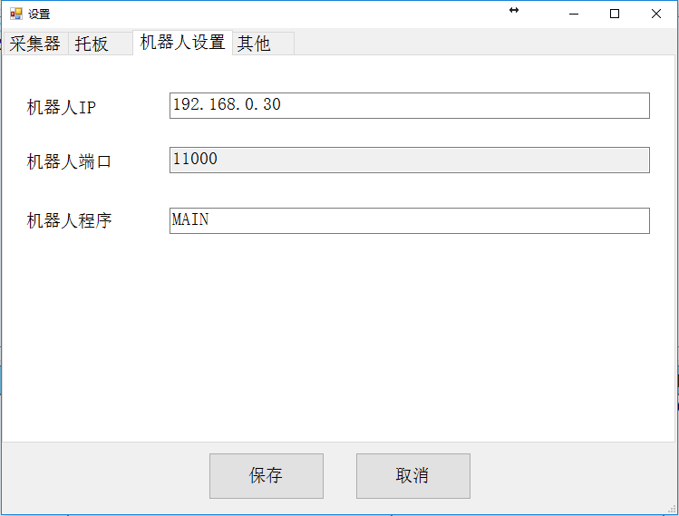
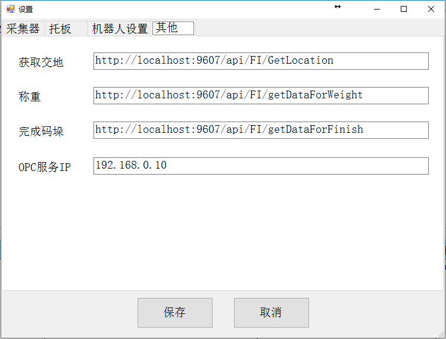
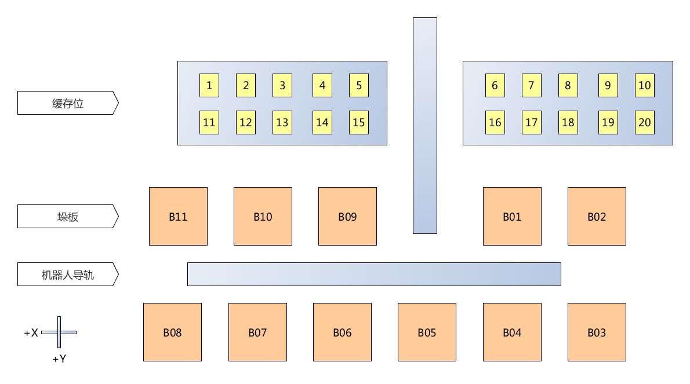
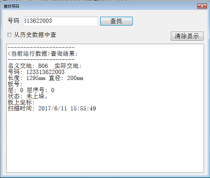
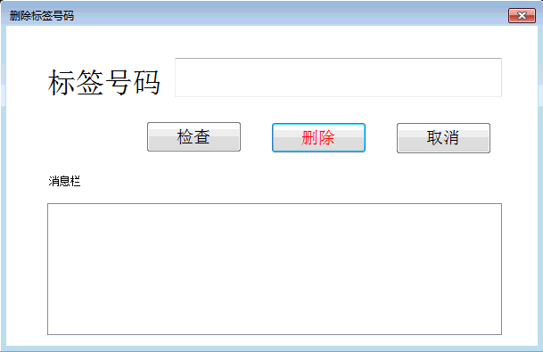
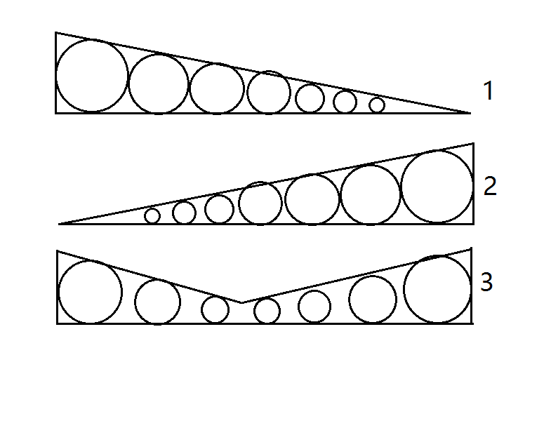

# 溢达机器人自动码垛软件使用说明

## 安装

本软件包含如下文件和目录：

- NLog.dll
- NLog.config
- Newtonsoft.Json.dll
- Newtonsoft.Json.xml
- OpcNetApi.Com.dll
- OpcNetApi.dll
- RobotControl.dll
- System.Data.SQLite.dll
- yidascan.exe
- yidascan.exe.config
- config.ini
- help <帮助文件目录>
- log <日志文件目录>

## 启动程序

鼠标双击桌面图标"溢达机器人码垛"。

也可以在软件目录里，鼠标双击yidascan.exe程序。

## 操作指南

### 主窗口说明

如上图所示，我们依次介绍主窗口各部分的名称和用途。

**工具条：** 包含软件系统的全部操作命令按钮。

<image src="images/buttons.png" width="800" />

**运行状态栏：** 显示计数器、流程运行状态、扫描到的标签号码、手持扫描号码输入栏、机器人状态等运行信息。

**号码表：** 显示进入软件系统的号码全列表。

**日志栏：** 分别显示号码扫描、称重、缓存位、机器人等节点的实时状态日志。

**数据流：** 从左到右，依次显示各节点的号码，及号码流动。节点包括：扫描位、称重位、缓存位、缓存区、标签朝向识别、v型支架。

**手动扫码：** 用于接收手持扫描枪的扫码数据。使用手持扫描枪时，光标应当停留在此输入框，否则不能采集到扫描数据。

**设备状态栏：** 显示OPC连接状态、采集器连接状态、机器人连接状态等。连接有效时，显示为绿色，无效时显示为灰色。

**计时器：** 从按下"启动"按钮时开始计时，到按下"停止"按钮时，停止计时。计时格式是：**天.小时:分钟:秒**。

### 功能说明

**1. 启动流程**

点击工具条按钮"新任务"，日志栏会显示启动流程，启动过程完成以后，计数器右侧的颜色条显示为浅绿色。

开始新任务时，所有的节点数据都会清零。所以务必保证生产线各节点上没有物料。

如果在生产过程中因故停下来，然后再继续时，可以点击"任务继续"按钮。这个按钮的功能也是启动生产线流程，但是不需要清除生产线各节点的物料，同时也不会清除软件内各队列的数据。

**注意：**

**在启动之前，应当留意选择是否启动机器人操作。通常，应当把"启动机器人"选择框打上勾，意味着启动机器人。**

**如果生产线调试时，不需要启动机器人操作，则应当把此项取消。**

**2. 停止流程**

点击工具条按钮"停止", 日志栏会显示停止流程，停止过程完成以后，计数器右侧的颜色条显示为橙色。

**3. 退出软件**

点击工具条按钮"退出"，软件系统会提示，要求用户确认退出，用户确认以后，软件系统结束运行。

系统退出时，会把当前各队列的数据保存到taskq.json文件。当再次打开软件时，这个文件内的数据会自动加载。

这意味着，你可以在生产停止的情况下，退出软件。当需要继续生产时，可以再打开软件，从上次停止的地方开始继续运行。

如果码垛流程正在进行中，软件的流程处于运行状态，此时是不能直接关闭软件的。正确的操作步骤是，应用鼠标点工具栏的"停止"按钮，停止工作流程，然后再点"退出"退出软件。**

**4. 配置**

配置各种通信参数和运行参数。

**4.1 设置采集器通信参数。**

采集器有两种通信方式，一种是串口通信，一种是以太网通信。

串口通信需要设置串口号和波特率，其中，波特率必须和设备自身设定的波特率一致。

以太网通信需要设置IP地址和端口，这两个参数由设备决定的，在设置时必须知道要连接的设备的IP地址和端口。

参数设好以后，按下"确定"按钮，保存参数。按"取消"按钮，则放弃所做的修改。

**4.2 设置托板参数。**

设置托板尺寸和布卷码垛参数。

长，宽：指垛板的尺寸。

限高：布卷码放的最大高度。

布卷间隙：布卷之间的间隔。

边缘预留：垛板上最靠边的布卷和垛板边缘的间隔。设置此参数是为避免布卷尺寸有误差，可能导致布卷掉出垛板。

缓存许可：在B区缓存比较布卷大小时，允许一定误差。因为如果严格按照布卷直径的数字比较，即使出现几毫米的差别，也会产生交换布卷位置的动作。而很多这样的交换是不必要的。缓存许可设置的，就是布卷直径比较时，忽略的直径差别。

**4.3 设置机器人参数。**

需要设置参数包括机器人IP地址和端口，以及机器人执行的程序名。

IP地址和端口：按照机器人示教器所显示的IP地址和端口设定。

机器人程序：机器人示教器上的程序名。本软件在发送给机器人码垛信号后，机器人会调用此程序。这个程序做的是抓料和移动到指定位置放料。程序代码在示教器上可以看到。

**4.4 设置其他参数。**

这里包括和ERP接口的通信地址，以及OPC的IP地址。

获取交地、称重、完成码垛三个通信地址，都由ERP系统提供。

OPC地址总是127.0.0.1。

**4.5 缓存位和托板编号。**

**5. 查看日志**

打开日志目录，然后选择目录下的日志文件，用任何文字编辑器都可以打开查看。

日志文件以日期命名。

**6. 其他功能**

**6.1 机器人启动**

当机器人需要单独启动时，点击此按钮，启动机器人运行。

**6.2 机器人停止**

当机器人流程需要单独停止时，点击此按钮，停止机器人运行。

**6.3 称重复位**

称重失败时，输送带停止。此功能告知OPC称重完成，可以让输送带继续走。

**6.4 查找标签**

根据标签号码，检索对应此号码的布卷信息。

点击"其他/查找号码"按钮，弹出对话框。

把输入焦点置于号码输入框，手工输入号码，也可以用手持扫描枪扫入号码。然后点"查找"按钮。

如果该号码存在于数据库或者线上，则此号码所属的交地、布卷长度和直径，在垛板上的位置，如板号、层号、坐标等，以及扫描时间等。

**6.5 删除标签**

扫描发生重码时，运行状态颜色条会显示红色，并显示"扫描重复"。此时，应当点击按钮"其他/删除标签"，弹出窗口。

首先，用手持扫描枪扫描需要删除的标签条码，扫描成功后，标签号码会显示在输入框里。也可以直接在输入框用键盘输入物料标签号码。

然后，点击按钮"检测"，查看这个号码是否存在。

最后，点击按钮"删除"，该号码就会从软件系统的号码队列和数据库中同时删除。

如果点按钮"取消"，则不会做删除动作，直接从此窗口退出。

消息栏会显示命令操作的结果。

**6.6 人工满板**

码垛过程中，可以通过把人工满板开关打倒"满板"位，满板红灯亮，终止某一个交地的码垛。

当码好的垛叉走，并放好空板时，复位满板开关，满板红灯灭，这个交地继续码垛。

**6.7 层形状不规则**

一层的布卷直径大小不一，如果这种不规则的程度过大，会使得其上层布卷倾斜，或者中间下沉。

所以系统在每层码满时，会判断这一层的布卷直径分布是否规则。假如出现一端过高或过低，或者两端高，中间过低等现象时，系统会给出报警，由人工调整布卷分布。

调整好以后，继续自动码垛。

**6.8 帮助**

显示本文档。

## 运行所需的软硬件环境和支持的设备

1. Windoes 7/8/10操作系统。

1. Miscrosoft Framework 4.5或以上。

1. Microsoft SQL Server 2008数据库。

1. 安川DX100机器人。

1. 普通手持一维条码扫描枪。

1. 吉恩士工业智能数字相机。

1. 其他支持OPC协议的PLC设备。

** ** **
项目开发：广州恒微机电设备有限公司

软件开发： Guangzhou Golden Beaver software workshop.a

林工 &lt;jine_gz@139.com&gt; 手机：13544376094

张工 &lt;laozhang_gz@139.com&gt;

更新时间：2017-03-16 10:02
